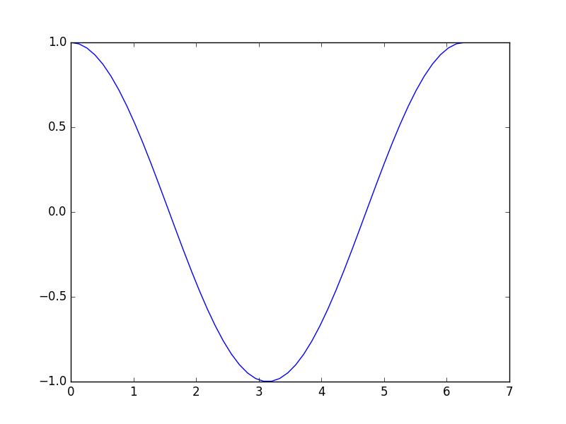

# MATLAB to Python cheatsheet

<!-- ==================== TOC using MarkdownTOC Sublime-Text plugin ===================== -->
<!-- MarkdownTOC depth=3 -->

- Getting started
    - What do we need?
    - Important
- Language fundamentals
    - Data types
    - Operators
    - Variables
    - Control flow
    - Functions
- Matrices
    - Create matrices
    - Basic operations
    - Element-by-element operations
    - Indexing
    - Concatenation
    - Shape manipulation
- Plotting
    - Lines
    - Grid and labels
    - Bars
    - Pie
    - Polar
    - Polygons
    - 3D-Curves
    - Surfaces
- Object-Oriented Programming
- Graphical User Interfaces
- References

<!-- /MarkdownTOC -->
<!-- ==============================  END TOC ================================= -->

<!-- ============================= PRE ================================= -->

## Getting started

### What do we need?

Some Python libraries installed to start:

* NumPy
* SciPy
* Matplotlib
* SymPy

### Important

The general structure of these notes is:

```matlab
% Some MATLAB code
x = 10;
disp(x);
```

```python
# followed by a equivalent/similar Python code
x = 10
print(x)
```


<!-- ============================= Contents ================================ -->


## Language fundamentals

### Data types

#### Numeric types


#### Booleans


#### Strings


#### Arrays


### Operators

#### Arithmetic operators

```matlab
% MATLAB
a = 10;
b = 20;
a + b; % Addition
a - b; % Subtraction
a * b; % Multiplication
a / b; % Division
```

```python
# Python
a , b = 10, 20
a + b # Addition
a - b # Subtraction
a * b # Multiplication
a / b # Division
```

#### Relational operators

```matlab
a == b  % Equal
a > b   % Greater than
a < b   % Less than
a >= b  % Greater than or equal
a <= b  % Less than or equal
a ~= b  % Not equal
```

```python
a == b  # Equal
a > b   # Greater than
a < b   # Less than
a >= b  # Greater than or equal
a <= b  # Less than or equal
a != b  # Not equal
```

#### Logical operators

```matlab
a && b      % Short-circuit logical AND
a || b      % Short-circuit logical OR
a & b       % Element-wise logical AND
a | b       % Element-wise logical OR
xor(a, b)   % Logical EXCLUSIVE OR
~a          % Logical NOT
```

```python
a and b     # Short-circuit logical AND
a or b      # Short-circuit logical OR
a and b     # Element-wise logical AND
a or b      # Element-wise logical OR
a ^ b       # Logical EXCLUSIVE OR
not a       # Logical NOT
```


### Variables

Assign variables:

```matlab
% Assign variables
a = 10;
```

```python
# Assign variables
a = 10
```

Multi assign:

```matlab
% Unsupported
```

```python
# Multi assign
a, b, c = 10, 20, 30
# a = 10 
# b = 20
# c = 30
```


### Control flow

#### if-else if-else

Only `if`:

```matlab
% Using if
a = 11
if a > 10
    disp('a is greater than 10');
end
```

```python
a = 11
if a > 10:
    print("a is greater than 10")
```

`if-else` structure:

```matlab
n = 1
if n > 0
    disp('n is positive');
else
    disp('n is negative or zero');
end
```

```python
n = 1
if n > 0:
    print('n is positive')
else:
    print('n is negative or zero')
```

#### For loop

```matlab
% for loop
for i = 1:10
    disp(i)
end
```

```python
# for loop
for i in range(1,11):
    print(i)
```

#### While loop

```matlab
% while loop
a = 1
while a < 10
    disp(a);
    a = a + 1;
end
```

```python
# while loop
a = 1
while a < 10:
    print(a)
     a += 1
```

#### Try - Catch

```matlab
try
    % Do something ...
catch err
    % On failure
end
```

```python
try:
    % Do something
except Exception:
    % On failure
end
```


### Functions

#### Creating a function

General syntax:

```matlab
function [out1, out2,...] = MyFun(arg1, arg2, ...)
% Code here...
% out1 = some1
% out2 = some2
% ...
end
```

```python
def MyFun(arg1, arg2, ...):
    # Code here ...
    return out1, out2, ...
```

Calling functions:

```matlab
% Calling MyFun
[out1, out2, ...] = MyFun(arg1, arg2, ...)
```

```python
# Calling MyFun
out1, out2, ... = MyFun(arg1, arg2, ...)
```

A simple example:


## Matrices

### Create matrices

### Basic operations

### Element-by-element operations

### Indexing

### Concatenation

### Shape manipulation


## Plotting

For all following Python codes are assumed that have been imported Numpy and Matplotlib as follows:

```python
import matplotlib.pyplot as plt
import numpy as np
```

### Lines

```matlab
x = linspace(0,2*pi);
y = cos(x)
plot(x, y)
```

```python
x = np.linspace(0,2*np.pi)
y = np.cos(x)

fig = plt.figure()
ax = fig.add_subplot(111)
ax.plot(x, y)
```




### Grid and labels

### Bars

### Pie

### Polar

### Polygons

### 3D-Curves

### Surfaces


<!--  OOP  -->
## Object-Oriented Programming


## Graphical User Interfaces


## References

1. [http://mathesaurus.sourceforge.net/matlab-numpy.html](http://mathesaurus.sourceforge.net/matlab-numpy.html)
2. [https://docs.scipy.org/doc/numpy-dev/user/numpy-for-matlab-users.html](https://docs.scipy.org/doc/numpy-dev/user/numpy-for-matlab-users.html)
2. [http://www.mathworks.com/help/matlab/](http://www.mathworks.com/help/matlab/)
3. [https://docs.python.org/2/reference/index.html](https://docs.python.org/2/reference/index.html)
4. [https://docs.scipy.org/doc/numpy-dev/user/quickstart.html](https://docs.scipy.org/doc/numpy-dev/user/quickstart.html)