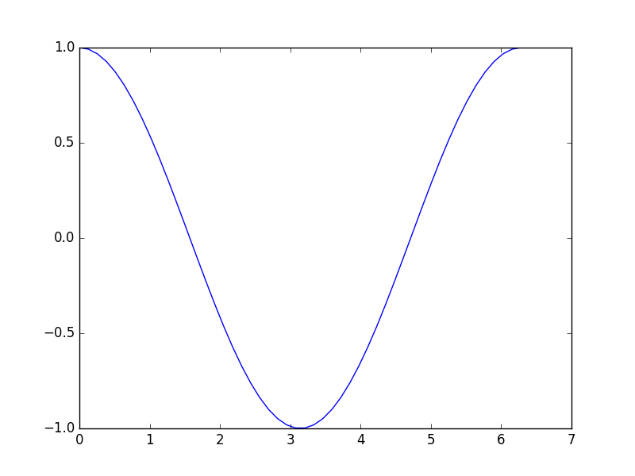

## Plotting

<!-- ==================== TOC using MarkdownTOC Sublime-Text plugin ===================== -->
<!-- MarkdownTOC depth=3 -->

- Lines
- Grid and labels
- Bars
- Pie
- Polar
- Polygons
- 3D-Curves
- Surfaces

<!-- /MarkdownTOC -->
<!-- ==============================  END TOC ================================= -->

For all following Python codes are assumed that have been imported Numpy and Matplotlib as follows:

```python
import matplotlib.pyplot as plt
import numpy as np
```

### Lines

```matlab
x = linspace(0,2*pi);
y = cos(x)
plot(x, y)
```

```python
x = np.linspace(0,2*np.pi)
y = np.cos(x)

fig = plt.figure()
ax = fig.add_subplot(111)
ax.plot(x, y)
```




### Grid and labels

### Bars

### Pie

### Polar

### Polygons

### 3D-Curves

### Surfaces
